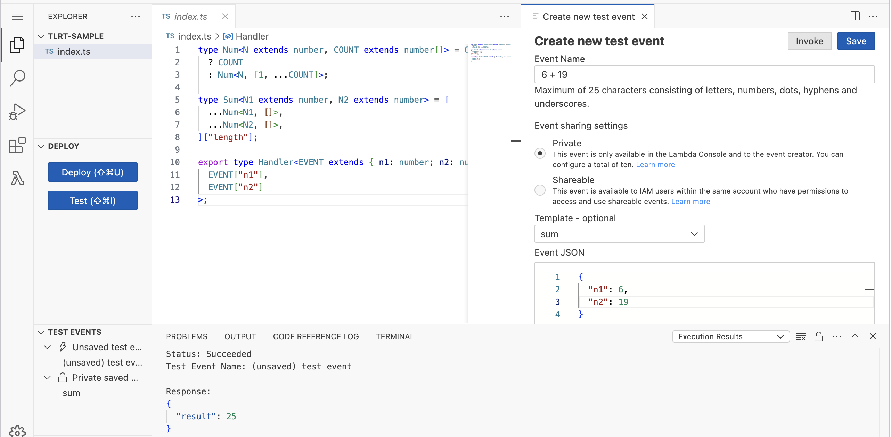

# aws-lambda-type-level-runtime

tlrt is a custom runtime for AWS Lambda that allows you to write lambda function in type level programming.

Define your handler function as a Handler type and implement it.
The following code is an example of a handler function that adds two numbers.

```typescript
type Num<N extends number, COUNT extends number[]> = COUNT["length"] extends N
  ? COUNT
  : Num<N, [1, ...COUNT]>;

type Sum<N1 extends number, N2 extends number> = [
  ...Num<N1, []>,
  ...Num<N2, []>,
]["length"];

export type Handler<EVENT extends { n1: number; n2: number }> = Sum<
  EVENT["n1"],
  EVENT["n2"]
>;
```

Upload this code to AWS Lambda and call the lambda function with the following event.

```json
{
  "n1": 9,
  "n2": 16
}
```

Then, you will get the following response.



There are only type definition codes, but it works.

You can download [runtime and terraform package](https://github.com/horita-yuya/aws-lambda-type-level-runtime/releases).

## TLRT Components:

### 1. bootstrap
This is a entrypoint called by AWS Lambda. It reads the input from the event and pass it to the function code you deployed.

### 2. compute-type-value
Combines the event passed to the lambda function and the function code you deployed.
And computed the value of it.

### 3. lambda-layer (terraform)
To use the above components, you need to create a lambda layer. This terraform module creates a lambda layer for you.
